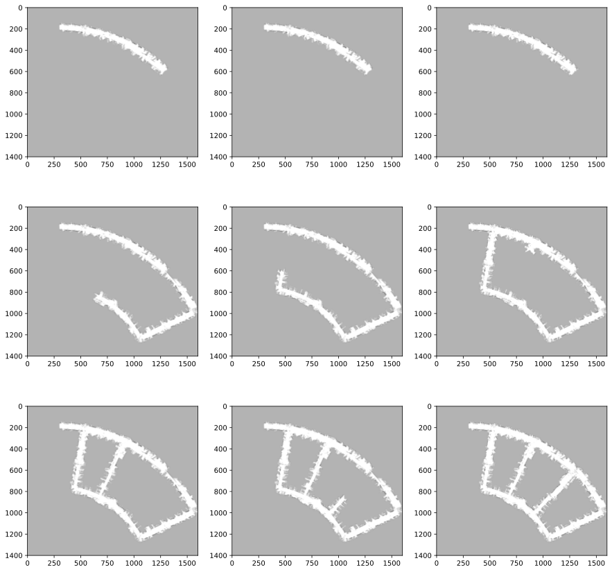
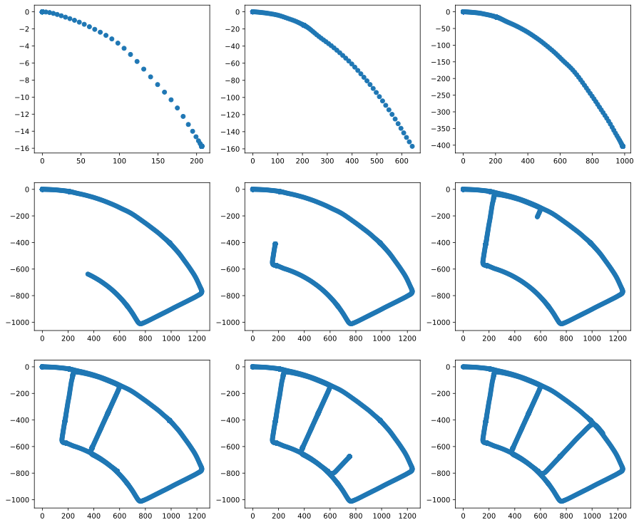

# Particle Filter SLAM
Simultaneous localization and mapping is the problem of localizing the robot and creating a map of the environment at the same time. This project contain code for particle filter SLAM algorithm. 
## Requirements

To install requirements:
```setup
pip install -r requirements.txt
```

## SLAM
To perform SLAM, run this script:

```train
python slam_main.py
```
> It's recommended to run this script in Jupyter environment.

## Visualization
### Mapping


### Localization


## Algorithm Design
Map
- center
- size
- update log odds
- get occupancy grid

Particle filter
- predict
    - use motion model
- update

Particles
- orientation
- location

Transform
- lidar_to_car
- camera_to_car

Sensors
- fog
- camera
- lidar
- encoder 